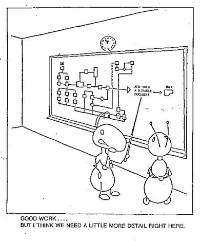

## Background

In the real world, "everything flows".  Heraclitus (Ancient Greece, ca.535 – ca.475 BC, known as "the weeping philosopher"), said it first: πάντα ῥεῖ (pronounced "panta rhei").  It is reasonable that data should flow too - it flows to and from storage devices, to and from screens, from keyboards, to printers, and sometimes it loops around and gets fed in again!  However, this concept doesn't really fit very well with what we call "procedural programming", which feels very different. In fact humans are not particularly good at procedural thinking!  Dr. Lance Miller of IBM looked for instances of procedural thinking in real life, and all he could come up with were recipes, and assembling toy kits...  Even recipes often have implicit parallelism which we donʼt notice. For instance, “add boiling water” implies that the water must have started boiling while some other step was going on, so that it would be available when needed.

How do you square this circle?  Years of training? Even that may not help a lot!  I once had the dubious pleasure of having to modify an update program (not Flow-Based Programming, obviously!) whose author had written the client an explanation of why his enhancement request could not be satisfied, which started, “Owing to the limitations of data processing,...”! My clear recollection is that modifying that program (and, for a conventional program, it was really quite well-written) was only *almost* impossible!

If application development is mostly about processing *data*, why not use an approach that is data-, rather than procedure-, oriented?  Describe the data, and the transforms that have to be applied to it.  Maybe start off with the final output data, and then work backwards to the original inputs...?

This tutorial is designed not only to introduce you, the reader, to the *concepts* of Flow-Based Programming (FBP), but  to give you a feeling for what it feels like to actually use the tool which supports these concepts in a number of different ways. FBP is "language-agnostic", but in this case we will using Java, as it is more closely integrated with the tool we will be using - [DrawFBP](https://github.com/jpaulm/drawfbp).  However, we could equally well use any other language which has an FBP implementation, although it would involve a bit more jumping back and forth between different tools.

Remember the (good?) old days?!  Lovely cartoon from the '70s or '80s:

