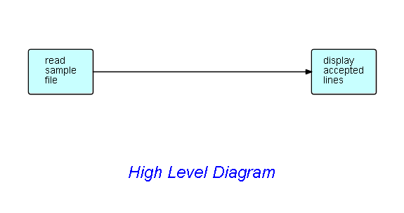

# Tutorial on Flow-Based Programming (Filter File application)

## Background

Flow-Based Programming (FBP) uses a "data processing factory" metaphor for designing and building applications. FBP defines applications as networks of "black box" processes, which communicate via data chunks (called Information Packets or IPs) travelling across predefined connections (think "conveyor belts"), where the connections are specified externally to the processes. These black box processes can be reconnected endlessly to form different applications without having to be changed internally. FBP is thus naturally component-oriented.

FBP is a special case of dataflow programming characterized by asynchronous, concurrent processes "under the covers", Information Packets with defined lifetimes, named ports, "bounded buffer" connections, and definition of connections external to the components - it has been found to support improved development time and maintainability, reusability, rapid prototyping, simulation, improved performance, and good communication among developers, maintenance staff, users, systems people, and management - not to mention that FBP naturally takes advantage of multiple cores... without the programmer having to struggle with the intricacies of multitasking!

This tutorial introduces the reader to the concepts of Flow-Based Programming, by means of diagrams built using DrawFBP, stepping the reader through the stages of designing networks, generating Java networks from them, and running the generated Java code, using precoded components, and (late) user-written components.  This example was originally developed by my collaborator, Bob Corrick.

Almost all data in FBP is managed as "chunks" called "Information Packets (IPs)", with a well-defined lifetime (from craetion to disposition), and unique ownership - an IIP can only be owned by one process, or it may be in transit between processes.  A special type of IP is called an "Initial Information Packet (IIP)", and refers to the technique FBP uses to parameterize components - IIPs are specified in the network definition, but are converted into normal IPs when they are "received" by a process. 

## Step 1.  Draw high level diagram of app to display contents of file. 

Here is a possible diagram:

In this step, you should install DrawFBP ( https://github.com/jpaulm/drawfbp ), and draw this diagram.

Save it in a work directory of your choice.  If you open it using Wordpad, it should look like the file you get when you click on [this link](docs/Step1.drw).

Of course, if you have trouble drawing the diagram, you can simply copy the `.drw` file, and open this file under DrawFBP.

At this point, you should take a look at the functions provided by DrawFBP.  DrawFBP has a Help facility, which takes you through a lot of the DrawFBP functionality.

Now at this point, you can simply assign real live components to the blocks in the diagrams (plus IIPs and port names), and you will basically have a running program.  However, I am going to assume that you want to add filter function between the two processes, so that is what we will do in Step2.

## Step2. Add a filter function 

In this step we are going to add a filter function between the two blocks shown above.  Filter functions (filters, for short) are commonly used in FBP, and typically have two outputs: accepted IPs, and rejected IPs.  Filters should not just drop rejected items, although they can be written this way - it is better for them to route rejected items to another process... which could very well just be a Discard process, if so desired.  In this case, we will do exactly that, as shown here.

## Step3. Assigning a component to the filter block

For the filter function, we need a component that will match the first character against a character provided as a parameter. As it happens, JavaFBP provides a precoded, reusable FBP component called `StartsWith`, which takes a character string as its parameter (specified using an IIP), and whose output port names are ACC and REJ.  

How do we find a suitable component?  Well, the first step is to install JavaFBP ( https://github.com/jpaulm/javafbp ) in a directory called `javafbp`.  The `javafbp/build/docs/javadoc` directory contains a list of components grouped by function, so we plan to provide a more FBP-oriented facility, which should be available shortly. 

**TODO: javadoc doesn't show port names and their functions! See issue #1.**

We now have to associate the `StartsWith` component with the filter block.  Since the component is in JavaFBP, you will need to use DrawFBP's Locate JavaFBP Jar File function, and then find `StartsWith` in that jar file, using the using the Choose Component/Subnet Class block function provided by DrawFBP. 

Since different components specify different port names, you need to find out the port names used by StartsWith.  Right now (Apr. 2019) there is no convenient mechanism to find this out (this should be available in the Javadoc, but it isn't! See issue #1). For now, you therefore have two mechanisms:

- go to the source code for the component in the JavaFBP repo ( `src/main/java/com/jpaulmorrison/fbp/core` ), and look at the annotations (`@OutPorts` and `@InPorts`), or 

- click on the `Display Description and Port Info` function provided for DrawFBP blocks (right clicking on `StartsWith` brings up the block menu), which will bring up a display like the following:

Of course, if you haven't filled in any of the port names, this display will show `NO` in the `Connected?` column.

**TODO: Port display for many components are missing functions of ports - these need to be filled in in JavaFBP.  See issue #2**

After filling in the `IN`, `ACC` and `REJ` port names, the diagram should now look like this:

If any port names have been misspelled, you will see a port name `Missing`, and another one unrecognized (`?` under `Connected?`).

## Step4.  Adding an IIP

Now, as shown in the port list shown above, `TEST` is the port name for the IIP specifying the test character for matching. As stated above, IIPs are the way FBP reusable components are parameterized.  Usually the parameter is specified in a network definition, so that a network can use the same component in more than one place in the network - with different parameters - but IIPs have the added advantage that the network can easily be changed to present the parameter information as a data chunk (normal IP), obtained from an upstream process.

In this case the parameter for `StartsWith` will be provided as an IIP, so we now have to add it to the diagram.  In DrawFBP just click on the button at the bottom marked `Initial IP`, and clicking on the drawing screen will now create an IIP, and allow some text to be entered.  The diagram now looks like this:

Selecting `StartWith` and clicking on `Display Description and Port Info` will verify that all ports are now correctly connected.

## Step5.  Associating components with the other blocks

Pretty straightforward: just click on each block, and select `Choose Component/Subnet Class`.  

The first block (`read sample file`) would most probably use the `ReadFile` component in the `core/components/io` package in the JavaFBP jar file.  This requires an IIP containing the file name - port name `SOURCE`.

The `ignore` block would most likely use the `Discard` component in the `core/components/routing` package, although of course you could use any component here, or even route the "ignored" IPs to other parts of the diagram.

That just leaves `display accepted lines`.  In his example, Bob Corrick decided to use the `ShowText` component.  This component puts up its output in a separate window, and requires an IIP with port name `TITLE`.  `ShowText` has an optional port called `OUT` - if this is connected, incoming IPs are routed to this port after being displayed.

Here is the final diagram:

## Step6.  Generating a running program

Now we have all the necessary information filled in to generate a running program, so click on `Generate Java Network` - Java is the default language, so this function has `Java` filled in in the File menu. This can be changed by clicking on `Select Diagram Language`: currently 4 languages are supported - Java, C#, JSON and FBP.

Here is the result:

