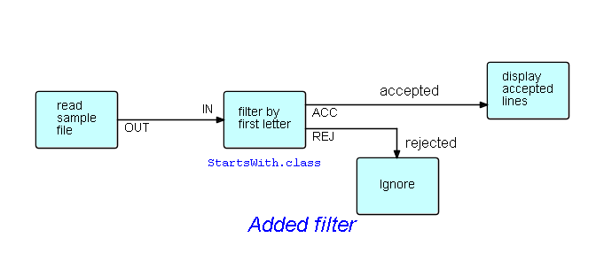

# Tutorial on Flow-Based Programming (Filter File application)

## Background

Flow-Based Programming (FBP) uses a "data processing factory" metaphor for designing and building applications. FBP defines applications as networks of "black box" processes, which communicate via data chunks (called Information Packets or IPs) travelling across predefined connections (think "conveyor belts"), where the connections are specified externally to the processes. These black box processes can be reconnected endlessly to form different applications without having to be changed internally. FBP is thus naturally component-oriented.

FBP is a special case of dataflow programming characterized by asynchronous, concurrent processes "under the covers", Information Packets with defined lifetimes, named ports, "bounded buffer" connections, and definition of connections external to the components - it has been found to support improved development time and maintainability, reusability, rapid prototyping, simulation, improved performance, and good communication among developers, maintenance staff, users, systems people, and management - not to mention that FBP naturally takes advantage of multiple cores... without the programmer having to struggle with the intricacies of multitasking!

During FBP's early days, networks were coded by hand, and initially we used pencil and paper, followed by more sophisticated graphical tools, whether or not they played well with FBP software. However, with the advent of good graphical support, we now have the powerful graphical tool [DrawFBP](https://github.com/jpaulm/drawfbp), and in recent years the emphasis has been shifting to doing the diagramming on-line, and then generating the networks (we can see this progression with other flow tools on the market). Now that compile and run functions have been added to DrawFBP, the developer can do much of the development graphically, and on-line. 

This tutorial introduces the reader to the concepts of Flow-Based Programming, by means of diagrams built using DrawFBP ( https://github.com/jpaulm/drawfbp ), a diagramming tool specifically oriented towards flow-based design and development, in which the reader is led through the stages of designing networks, generating Java networks from them, and running the generated Java code, using precoded components, and (later) user-written components.  This example was originally developed by my collaborator, Bob Corrick.

Almost all data in FBP is managed as "chunks" called "Information Packets (IPs)", with well-defined lifetimes (from creation to disposition), and unique ownership - an IIP can only be owned by one process, unless it is in transit between processes.  A special type of IP is called an "Initial Information Packet (IIP)", and refers to the technique FBP uses to parameterize components - IIPs are specified in the network definition, but are converted into normal IPs when they are *received* by a process. 

## Step 1.  Draw high level diagram of app to display contents of file. 

[Step1. Draw high level diagram of app to display contents of file.](Step1/Step1.md)

[Step2. Add a filter function.](Step2/Step2.md)

[Step3. Assigning a component to the filter block.](Step3/Step3.md)

[Step4. Specifying an IIP.](Step4/Step4.md)

[Step5. Associating components with the other blocks.](Step5/Step5.md)

[Step6. Generating a running program.](Step6/Step6.md)

[Step7. Running the program.](Step7/Step7.md)

[Step8. What does a component look like?](Step8/Step8.md)

[Step9. Design "directions".](Step9/Step9.md)

[Step10. Extending the diagram.](Step10/Step10.md)

[Step11. Combining the outputs.](Step11/Step11.md)

## Step2. Add a filter function 

In this step we are going to add a filter function between the two blocks shown above.  Filter functions (filters, for short) are commonly used in FBP, and conventionally have two outputs: *accepted* IPs, and *rejected* IPs.  Filters should not just drop rejected items, although they can be written this way - it is better for them to route rejected items to another process... which could very well just be a Discard process, if so desired.  In this case, we will do exactly that, as shown here.

The captions `accepted` and `rejected` are generated using a block type in DrawFBP called "Legend".

When you are ready to add the filter function, you will of course need to delete the existing arrow - right click on the arrow itself, and select Delete.

## Step3. Assigning a component to the filter block

For the filter function, we need a component that will match the first character against a character provided as a parameter. As it happens(!), JavaFBP provides a precoded, reusable FBP component called `StartsWith`, which takes a character string as its parameter (specified using an IIP), and whose output port names are ACC and REJ.  **FBP is not designed to be a coding language**.  The ideal is to work with a library of precoded, pretested components.  **You only need to write a component if you can't find an appropriate one - and in that case, you should try to write one that other people will find useful.**

How do we find a suitable component?  Well, the first step is to install JavaFBP ( https://github.com/jpaulm/javafbp ) in a directory called `javafbp`.  Components are grouped by function, so you can either go there directly, or you can display the JavaFBP components list by clicking on https://htmlpreview.github.io/?https://github.com/jpaulm/javafbp/blob/master/compList.html then `Edit/Find in This Page` (unfortunately you cannot click on the `compList.html` file directly on GitHub).  The Javadoc facility does not provide the information you will need, so we will not be maintaining it in future releases.

**TODO: javadoc doesn't show port names and their functions! See issue #1. Closed**

Here is a portion of `compList`:

We now have to associate the `StartsWith` component with the filter block.  Since the component is in JavaFBP, you will need to use DrawFBP's `Locate JavaFBP Jar File` function, and then find `StartsWith` in that jar file, using the `Choose Component/Subnet Class` block function provided by DrawFBP. 

Since different components specify different port names, you need to find out the port names used by `StartsWith`.  There are three ways available to do this:

- go to the source code for the component in the JavaFBP repo ( `src/main/java/com/jpaulmorrison/fbp/core` ), and look at the annotations (`@OutPorts` and `@InPorts`), or 

- once you have associated a component with your block in the diagram, you can right click on the `Display Description and Port Info` function provided for DrawFBP blocks, which will bring up a display like the following (doing the associate function will also bring this up):

Of course, if you haven't filled in any of the port names, this display will show `NO` in the `Connected?` column.

- look at `compList.html` by clicking on http://htmlpreview.github.io/?https://github.com/jpaulm/javafbp/blob/master/compList.html , then `Edit/Find in This Page` .

**TODO: Port display for many components are missing port function annotations - these need to be filled in in JavaFBP.  See issue #2**

After filling in the `IN`, `ACC` and `REJ` port names, the diagram should now look like this:

If any port names have been misspelled, you will see a port name `Missing`, and another one unrecognized (`?` under `Connected?`).

## Step4.  Specifying an IIP

Now, as shown in the port list shown above, `TEST` is the port name for the IIP which specifies the test character for matching. As stated above, IIPs are the way FBP reusable components are parameterized.  Usually the parameter is specified in a network definition, so that a network can use the same component in more than one place in the network - with different parameters - but IIPs have the added advantage that the network can easily be changed to present the parameter information as a normal IP, obtained from an upstream process.

In this case the parameter for `StartsWith` will be provided as an IIP, specified in the diagram.  In DrawFBP just click on the button at the bottom marked `Initial IP`, after which clicking on the drawing screen will now create an IIP, and allow some text to be entered.  The diagram now looks like this:

Selecting `StartWith` and clicking on `Display Description and Port Info` will verify that all ports are now correctly connected.

## Step5.  Associating components with the other blocks

Pretty straightforward: just click on each block, and select `Choose Component/Subnet Class`.  

The first block (`read sample file`) would most probably use the `ReadFile` component in the `core/components/io` package in the JavaFBP jar file.  This requires an IIP containing the file name - port name `SOURCE`.

The `ignore` block would most likely use the `Discard` component in the `core/components/routing` package, although of course you could use any component here, or even route the "ignored" IPs to other parts of the diagram.

That just leaves `display accepted lines`.  In his example, Bob Corrick decided to use the `ShowText` component.  This component puts up its output in a separate window, and requires an IIP with port name `TITLE`.  `ShowText` has an optional port called `OUT` - if this is connected, incoming IPs are routed to this port after being displayed.

Here is the final diagram:

## Step6.  Generating a running program

Now we have all the necessary information filled in to generate a running program, so click on `Generate Java Network` - Java is the default language, so this function has `Java` filled in in the File menu. This can be changed by clicking on `Select Diagram Language`: currently 4 languages are supported - Java, C#, JSON and FBP.

Here is the result:

DrawFBP remembers the last used package name, so it allows the developer to change it to whatever matches the directory structure - or Eclipse will prompt him/her to change it, if necessary, when the code is executed. 

DrawFBP's colouring of code is mostly to make character strings and comments stand out from the rest of the text.

`component` and `connect` are self-explanatory! `initialize` builds an IIP, and connects it to an input port of a component.

## Step7.  Running the program

The generated code shown above is a standard JavaFBP network, and can be executed as described in https://github.com/jpaulm/javafbp/blob/master/README.md .

Nearly forgot - we need to give it some data: ReadFile handles any sequential file.  In this case we are pointing it at a CSV file ( https://en.wikipedia.org/wiki/Comma-separated_values ), and the selected records will appear in a separate window. 

## Step8.  What does a component look like?

Building a component is relatively simple, but I would like to stress again that you can do a lot of the work involved in building an application without ever doing any coding!  However, if you are interested, you can click on [this link](StartsWith.md).  Theoretically you can write components in any language that has an FBP implementation, but you may find yourself having to be creative to get different languages to intercommunicate... especially languages that are implemented by means of a virtual machine.  We will be showing you how to do this later on in the tutorial.

## Step 9. Design "directions"

As you may have intuited, in FBP we like to go from a high-level design to progressively lower levels, until we are ready to start filling in component names.  High-level components can also be replaced with what are called "subnets": diagrams with "sticky" connections, that can both function as components but can be further broken down.  This keeps the visual mode of FBP without having huge networks with dozens of blocks in a single chart.  In fact DrawFBP has a facility called "Excise" where the designer marks off a section of the diagram and "excises" it, forming a subnet and replacing the excised subnet with a single block that instantiates the subnet.  The sticky ends are called "External Ports" - more about them later.

This style of development is usually called "top-down", but other "directions" have been found useful as well.  This section is from my book:

"... The data streams which tend to drive all the others are the ones which humans will see, e.g. reports, etc., so you design these first. Then you design the processes which generate these, then the processes which generate their input, and so on. This approach to design might be called 'output backwards'...." 

Another "direction" is one I call "centre out": again from my book: " ... the 'centre out' development approach – you can get the core logic working first, and then add formatting, input editing, etc., later."

FBP also lends itself very well to rapid prototyping, and simulation as well - see the discussion about simulation systems in [Chapter I of my book](http://www.jpaulmorrison.com/fbp/intro.shtml) .  You can also start with a *simulation* of your application, and gradually replace the blocks with real application functions. 

## Step10. Extending the diagram

For this step we will stay at the diagram level - these changes could of course be made to the *generated code*, but then the code would become progressively more out of step with the diagram, which is perhaps the most important tool of communication between the various groups involved in the development of an application.

Let us now suppose that we want to count the number of rejected IPs before discarding them.  Surprise!  We happen to have a Counter component in our bag of tricks: a count IP goes to one output port, incoming IPs are routed to the other (optional) output port.  

Here is the modified diagram (we are showing it without the components or port names filled in - to stress that this is happening at the high level design stage):

Here is the segment of [compList](http://htmlpreview.github.io/?https://github.com/jpaulm/javafbp/blob/master/compList.html) that gives the port names for Counter:

As you have probably figured out, the counter *creates* a count IP and sends it out.  

Port `OUT` is marked *optional*.  `Counter` tests if this port is connected - and, if not, it discards IPs that are sent to this port. In what follows, we will drop the `Ignore` block.

## Step11. Combining the outputs

Now you will have noticed that there are two `Display` blocks - if you use a windowing component like `ShowText`, you will see two windows; if you use console components the outputs may be intermingled - remember that FBP is totally asynchronous. So maybe we want to combine the outputs, with the count following the accepted IPs.  Our first attempt might look like this:

The count cannot be generated until the inputs have all been read, so the various outputs should be displayed in the right order, but the generated count could wind up intermixed with the "accepted" stream if certain changes are made to the network.  So we should really ensure that the count is not displayed until after *all* the accepted IPs have been displayed.  We do this using the `routing.ConcatStreams` component, as follows:

`ConcatStreams` reads and outputs all of its first input, followed by the second input, and so on.  If `ConcatStreams` could only handle, say, two input streams, it might call them `IN1` and `IN2`, but it can handle any number, so it uses something called an "array port", and the individual connection points are labelled using an indexing notation, e.g. `IN[0]`, `IN[1]`, and so on.  

