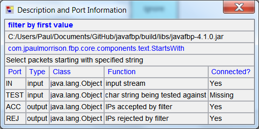
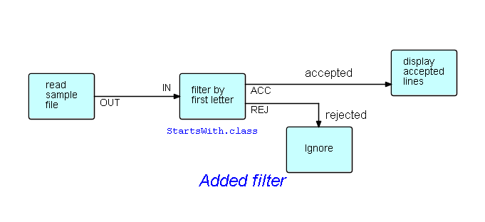

<link href="../style.css" rel="stylesheet" type="text/css">

## Step03 - Choose a component for a part

For the filter function, we need a component that will match the first character against a character provided as a parameter. As it happens(!), JavaFBP provides a precoded, reusable FBP component called `StartsWith`, which takes a character string as its parameter (specified using an IIP), and whose output port names are ACC and REJ.  **FBP is not designed to be a coding language**.  The ideal is to work with a library of precoded, pretested components.  **You only need to write a component if you can't find an appropriate one - and in that case, you should try to write one that other people will find useful.**

How do we find a suitable component?  Well, the first step is to install JavaFBP ( https://github.com/jpaulm/javafbp ) as described in Step00, and use DrawFBP's `Locate JavaFBP Jar File` function.

We now have to associate the `StartsWith` component with the filter block.  Since the component is in JavaFBP, you will need to use the `Choose Component/Subnet Class` block function provided by DrawFBP. This will bring up a `File Chooser` function, which you can use to locate `StartsWith`. In the first panel of `File Chooser`, you will see the JavaFBP jar file, followed by any other jar files you have added (using the `File/Add Additional Jar File` function), followed by the top level directories for the project you are working on.

Click on the JavaFBP jar file entry, and you can start walking through its tree structure, until you find the component you need, which is in the package `com/jpaulmorrison/fbp/core/components/text`.

Since different components specify different port names, you need to find out the port names used by `StartsWith`.  Here are three ways that are available to do this:

- go to the source code for the component in the JavaFBP repo ( `src/main/java/com/jpaulmorrison/fbp/core` ), and look at the annotations (`@OutPorts` and `@InPorts`), or

- choose a component for your block in the diagram, and right click on the `Display Description and Port Info` function provided for DrawFBP blocks, which will bring up a display like the following:

Of course, if you haven't yet filled in any of the port names, this display will show `No` in the `Connected?` column.

- Or look at `compList.html` by clicking on http://htmlpreview.github.io/?https://github.com/jpaulm/javafbp/blob/master/compList.html , then `Edit/Find in This Page` .

**TODO: Port display for many components are missing port function annotations - these need to be filled in in JavaFBP.  See issue #2**

After filling in the `IN`, `ACC` and `REJ` port names, the diagram should now look like this:

If any port names have been misspelled, you will see a port name `Missing`, and another one unrecognized (`?` under `Connected?`).

 &lt;== <a href="../Step02/">  Previous</a> / <a href="https://github.com/jpaulm/fbp-tutorial-filter-file/"> Index</a> / <a href="../Step04/"> Next</a> ==&gt;
