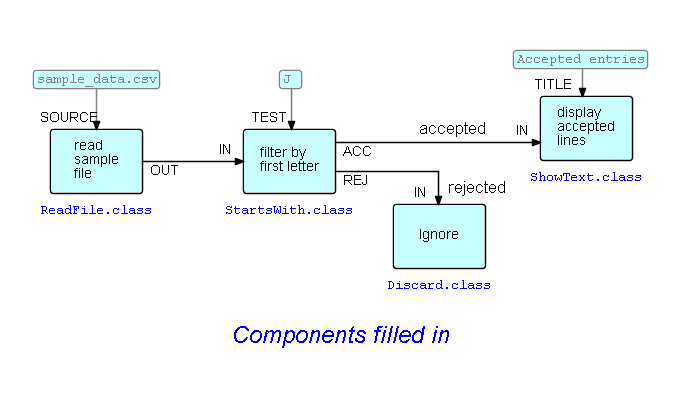

<link href="../style.css" rel="stylesheet" type="text/css">

## Step05-Choose components and set values for other parts

Pretty straightforward: just click on each block, and select `Choose Component/Subnet Class`.  

This will present the "File Chooser" dialog.  Assuming you have (successfully) used the `Locate JavaFBP Jar File` function, the first line will be the root of that jar file.  Other entries will be from your working component directory. Any time you use the `Add Aditional Jar File` function, more jar files will be added to the top of the "File Chooser" file list.

The first block (`read sample file`) would most probably use the `ReadFile` component in the `core/components/io` package in the JavaFBP jar file.  This requires an IIP containing the file name - port name `SOURCE`.

The `ignore` block would most likely use the `Discard` component in the `core/components/routing` package, although of course you could use any component here, or even route the "ignored" IPs to other parts of the diagram.

That just leaves `display accepted lines`.  In his example, Bob Corrick decided to use the `ShowText` component.  This component puts up its output in a separate window, and requires an IIP with port name `TITLE`.  `ShowText` has an optional port called `OUT` - if this is connected, incoming IPs are routed to this port after being displayed.

Here is the final diagram:

 &lt;== <a href="../Step04/">  Previous</a> / <a href="https://github.com/jpaulm/fbp-tutorial-filter-file/"> Index</a> / <a href="../Step06/"> Next</a> ==&gt;
