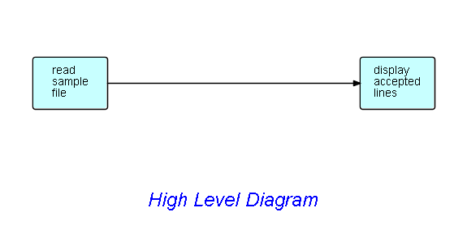

<link href="../style.css" rel="stylesheet" type="text/css">

## Step 1.  Draw high level diagram of app to display contents of file. 

Here is a possible diagram, showing a simple application which displays the contents of a file:

To execute this step of the tutorial, you will need to install DrawFBP, and draw this diagram.

Save the result in a work directory of your choice.  If you open it using Wordpad, it should look like the file you get when you click on [this link](Step1.drw).

Of course, if you have trouble drawing the diagram, you can go the other way - simply copy the `.drw` file, and open this file under DrawFBP.

At this point, you should take a look at the functions provided by DrawFBP.  DrawFBP has a Help facility, which takes you through a lot of the DrawFBP functionality.

Now at this point, you can simply assign real live components to the blocks in the diagrams (plus IIPs and port names), and you will basically have a running program.  However, I am going to assume that you want to add a filter function between the two processes in the design phase (rather than later as the application "evolves"), so that is what we will do in Step2.

 &lt;== <a href="../Step0/">  Previous</a> / <a href=".."/README.md> Index</a> / <a href="../Step2/"> Next</a> ==&gt; 
