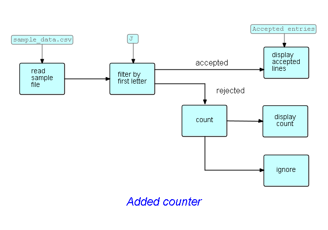
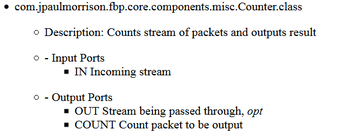

<link href="../style.css" rel="stylesheet" type="text/css">

## Step10. Extending the diagram

For this step we will stay at the diagram level - these changes could of course be made to the *generated code*, but then the code would become progressively more out of step with the diagram, which is perhaps the most important tool of communication between the various groups involved in the development of an application.

Let us now suppose that we want to count the number of rejected IPs before discarding them.  Surprise!  We happen to have a Counter component in our bag of tricks: a count IP goes to one output port, incoming IPs are routed to the other (optional) output port.  

Here is the modified diagram (we are showing it without the components or port names filled in - to stress that this is happening at the high level design stage):

Here is the segment of [compList](http://htmlpreview.github.io/?https://github.com/jpaulm/javafbp/blob/master/compList.html) that gives the port names for Counter:

As you have probably figured out, the counter *creates* a count IP and sends it out.  

Port `OUT` is marked *optional*.  `Counter` tests if this port is connected - and, if not, it discards IPs that are sent to this port. In what follows, we will drop the `Ignore` block.

 &lt;== <a href="../Step9/">  Previous</a> / <a href="../README.md"> Index</a> / <a href="../Step11/"> Next</a> ==&gt;