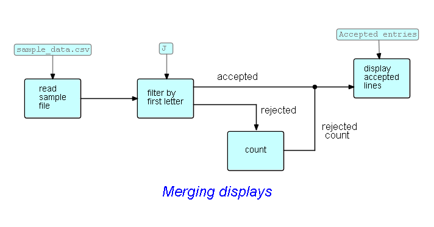
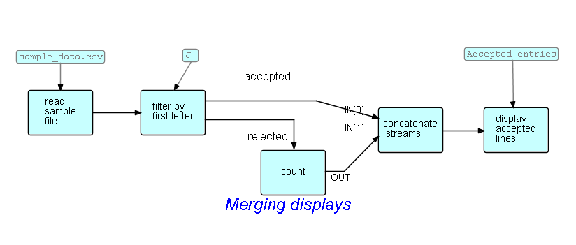

<link href="../style.css" rel="stylesheet" type="text/css">

## Step11-Combine data flows

Now you will have noticed that there are two `Display` blocks - if you use a windowing component like `ShowText`, you will see two windows; if you use console components the outputs may be intermingled - remember that FBP is totally asynchronous. So maybe we want to combine the outputs, with the count following the accepted IPs.  Our first attempt might look like this:

The count cannot be generated until the inputs have all been read, so the various outputs should be displayed in the right order, but the generated count could wind up intermixed with the "accepted" stream if certain changes are made to the network.  So we should really ensure that the count is not displayed until after *all* the accepted IPs have been displayed.  We do this using the `routing.ConcatStreams` component, as follows:

`ConcatStreams` reads and outputs all of its first input, followed by the second input, and so on.  If `ConcatStreams` could only handle, say, two input streams, it might call them `IN1` and `IN2`, but it can handle any number, so it uses something called an "array port", and the individual connection points are labelled using an indexing notation, e.g. `IN[0]`, `IN[1]`, and so on.  

 &lt;== <a href="../Step10/">  Previous</a> / <a href="https://github.com/jpaulm/fbp-tutorial-filter-file/"> Index</a> / <a href="../Step12/"> Next</a> ==&gt;

