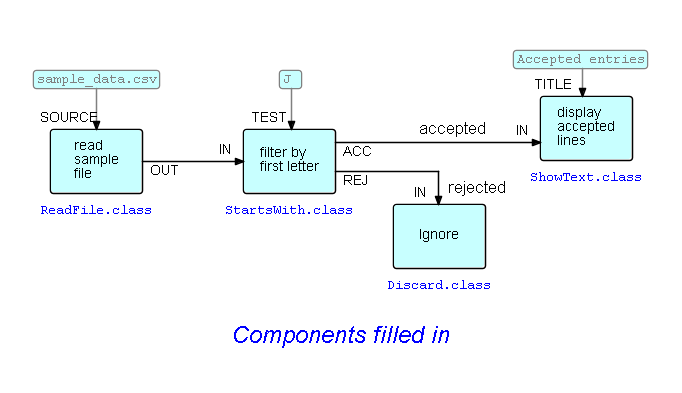

<link rel="stylesheet" type="text/css" href="../style.css">

## Step12-Subnets

As we stated above, FBP has a concept called "subnets", which may be thought of as ordinary FBP networks, with "sticky" connections.  In FBP we like to go from a high-level design to progressively lower levels, until we are ready to start filling in component names. These lower-level networks are called "subnets" - basically diagrams with "sticky" connections, that can both function as components but themselves comprise components - or still lower-level subnets - so a complex application may be structured as a "tree" of subnets, where the root is a high-level network with all or most of the nodes being subnets.

DrawFBP has a facility called "Excise" where the designer marks off a section of the diagram and "excises" it, forming a subnet and replacing the excised subnet with a single block that instantiates the subnet. The sticky ends are called "External Ports", and form the "bridge" between the indide and the outside of a subnet.

Let us go back to the diagram we show in <a href="../Step05/">Step05-Choose components and set values for other parts</a>:

Now let us suppose we want to hid the "Ignore" node - we can "excise" the middle two components and put them in a separate subnet called, say, "Filter".  

The way we do this is to create an instance of the "Enclosure" block type, and *stretch* it to surround the blocks we want to excise - mouse over the corners, and drag them to where you want them to be.  Here is the diagram with the Enclsure added.

Now the only part of the Enclosure which you can click on to get the action list is the coloured section at the top.

 &lt;== <a href="../Step11/">  Previous</a> / <a href="https://github.com/jpaulm/fbp-tutorial-filter-file/"> Index</a> /  Next ==&gt; (none)
