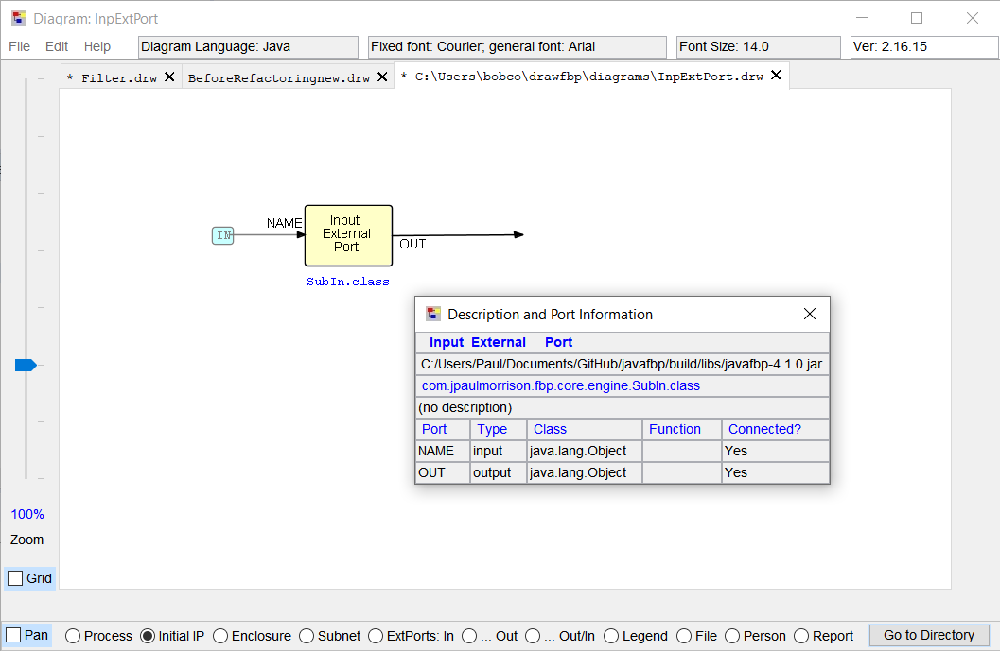
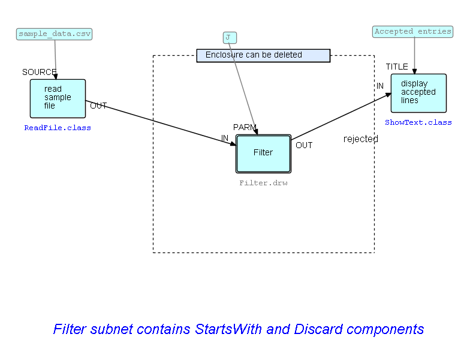

<link rel="stylesheet" type="text/css" href="../style.css">

## Step12 - Subnets

As we stated above, FBP has a concept called "subnets", which may be thought of as ordinary FBP networks, but with "sticky" connections.  FBP supports a "top-down" approach to develioping applications, where design goes from a high-level design, initially with no components filled in, to progressively lower levels.  At some point later, we can start filling in component names. These lower-level networks are called "subnets" - basically diagrams that can both function as components but themselves will comprise components or still lower-level subnets - so a complex application will typically be structured as a "tree" of subnets, where the root is a high-level network with all or most of the nodes being subnets.

Of course, during the design process, there is also a process working "upwards" from the component level.  Imagine designing a house: working down from the highest level, you do not suddenly find drywall emerging magically from the design: drywall is one of the components in your "bag of tricks", and at some point you realize that drywall will be useful, and you start adapting your design to work with thatworking down towards that. If, at some point in the deign, you decide you are going to go with concrete block, the design will take a different path.  

Now, a designer can certainly build a subnet by hand, but it could be tricky to get it right, so DrawFBP has a facility called "Excise" where the designer marks off a section of the diagram and "excises" it, forming a subnet and replacing the excised subnet with a single block that represents the whole subnet. The sticky ends are called "External Ports", and form a bridge between the inside and the outside of a subnet. Subnets thus partake of both the nature of networks and components.

Let us go back to the diagram we show in <a href="../Step05/">Step05-Choose components and fill in values for other parts</a>:

Now let us suppose we want to turn the two centre processes into a subnet - this will also have the benefit of hiding the "Ignore" node - we will call the subnet called "Filter".  

The way we do this is to create an instance of the "Enclosure" block type, and *stretch* it to surround the blocks we want to excise - mouse over the corners, and drag them to where you want them to be.  Here is the diagram with the Enclosure added.

You will see that three of the arrows in this diagram are crossed by the dotted lines:  these are the connections which connect the inside and the outside of the Enclosure, so the Excise function will add "External Ports", and hook up these connections to them.  External ports are actually processes in their own right, but have a different symbol on the diagram.  The single block that will replace the old subnet in the original diagram is shown with double line boundaries to show it is a subnet.  

Now the only part of the Enclosure which you can click on to get the action list is the coloured section at the top.  So the best way to grasp this logic is to start by clicking on this, and then select the `Excise Subnet` function.   Let's do it!

The first thing that happens is that Excise will prompt you to provide a subnet name.  It does not need an extension, so "Filter" will do.

Next you will be prompted to enter External Port names. These are the port names that the connections with *outside* processes will use. These external ports are show with a particular symbol, and their *external* names are shown in red.  During this process, the External Port you are being prompted about is shown in yellow.  In case you were wondering, the *internal* names of these external ports are standard, so they are not shown.

Here is the last External Port with its assigned name (the order in which you are prompted for External Port names is somewhat random!):

The actual code for `Filter.java` can be seen at [Code for "Filter"](code/Filter.java).  Note that the input External Ports both use a standard component `SubIn`, while the output External Port uses component `SubOut`.  The External Port *name* is passed to the process via an IIP. 

The External Port symbol may be thought of as a kind of visual shorthand, as all the parts are predetermined except for the external names.  Here is a diagram showing an External Port "blown up" - it also shows the port information:

And here is the original diagram with the subnet replaced by a single (subnet) block:

DrawFBP will now let you modify both the subnet and what we might call the "supranet" - its parent - you can double-click on the subnet block to switch your view to the subnet itself.

In the "supranet" there is now a reference to a subnet, which is a `.drw` file.  To generate Java code, *all* the nodes in a diagram must have a Java `.class` file associated with them as well.  So *for the new subnet*, do a `File/Generate Java Network`, followed by a `File/Compile`.  Now associate the `.class` file with the subnet block, using the `Block/Choose Component or Subnet Class` - this will result in the display shown below.  You can now generate the Java code for the "supranet".  Here is the display showing both the `.class` file and the subnet `.drw` file for the subnet block.

 &lt;== <a href="../Step11/">  Previous</a> / <a href="https://github.com/jpaulm/fbp-tutorial-filter-file/"> Index</a> /  <a href="../Step13/"> Next</a> ==&gt;
