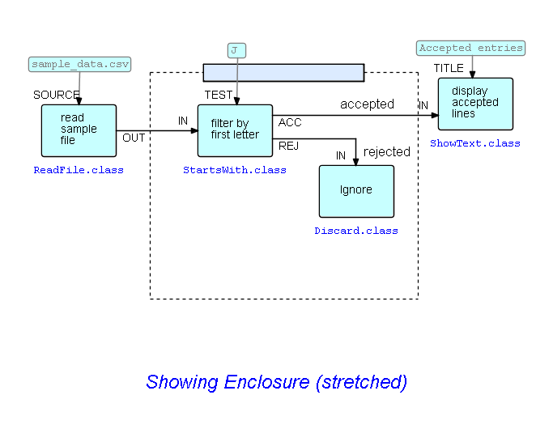

<link rel="stylesheet" type="text/css" href="../style.css">

## Step12-Subnets

As we stated above, FBP has a concept called "subnets", which may be thought of as ordinary FBP networks, with "sticky" connections.  In FBP our usual approach is to go from a high-level design to progressively lower levels, until we are ready to start filling in component names. These lower-level networks are called "subnets" - basically diagrams with "sticky" connections, that can both function as components but themselves comprise components - or still lower-level subnets - so a complex application may be structured as a "tree" of subnets, where the root is a high-level network with all or most of the nodes being subnets.

DrawFBP has a facility called "Excise" where the designer marks off a section of the diagram and "excises" it, forming a subnet and replacing the excised subnet with a single block that instantiates the subnet. The sticky ends are called "External Ports", and form a bridge between the inside and the outside of a subnet.

Let us go back to the diagram we show in <a href="../Step05/">Step05-Choose components and set values for other parts</a>:

Now let us suppose we want to turn the two centre processes into a subnet - this will also have the benefit of hiding the "Ignore" node - we will call the subnet called "Filter".  

The way we do this is to create an instance of the "Enclosure" block type, and *stretch* it to surround the blocks we want to excise - mouse over the corners, and drag them to where you want them to be.  Here is the diagram with the Enclosure added.

You will see that three of the arrows in this diagram are crossed by the dotted lines:  these are the connections which connect the inside and the outside of the Enclosure, so the Excise function will add "External Ports", and hook up these arrows to them.  External ports are actually processes in their own right, and have a different symbol on the diagram.  The single block that will replace the old subnet in the original diagram is shown with double line boundaries.  

Now the only part of the Enclosure which you can click on to get the action list is the coloured section at the top.  So the best way to grasp this logic is to start by clicking on this, and then select the `Excise Subnet` function.   Let's do it!

### Enter subnet name

The first thing that happens is that Excise will prompt you to provide a subnet name.  It does not need an extension, so "Filter" will do.

Next you will be prompted to enter External Port names. These are the port names that connections with *outside* processes will use. Since the external port name is a *parameter* to the External Port process it is encoded in an IIP.  This may be a bit confusing at first!  The External Port labelled `IN` in subnet "Filter" actually has two ports of its own: `NAME`, connected with the IIP holding the string `PARM` (this is not shown in the diagram, as the `NAME` parameter is just shown in red;  and `OUT`, which sends data IPs arriving from outside the subnet to inside the subnet!  Note that the External Port you are being prompted about is shown in yellow.

Here is the last External Port with its assigned name (the order in which you are prompted for External Port names is random!):

 &lt;== <a href="../Step11/">  Previous</a> / <a href="https://github.com/jpaulm/fbp-tutorial-filter-file/"> Index</a> /  Next ==&gt; (none)
