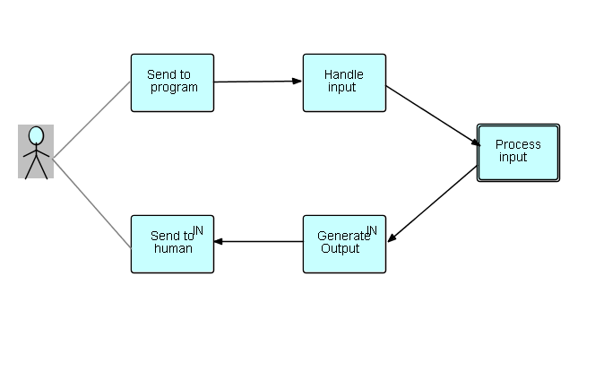

<link rel="stylesheet" type="text/css" href="../style.css">

## Step13 - "Brackets" and "substreams"

### Grouping records

Up to now we have been dealing with "streams" of data chunks called "Information Packets" (IPs), but very often we want to subdivide the IP stream into smaller (often nested) groupings.  We call them "substreams", and they are delimited by special non-data IPs called "open bracket" and "close bracket".

Here is an example from the book "Flow-Based Programming" (Fig. 9.1).  We show a typical sequential file, with two levels of groupings: branch, and account.  Note that there are often no special records showing the beginning or end of a grouping - this often has to be detected by changes in "control fields".

```
 IP type     branch   acct #      date       amount   DEP/WD

 account        1        1
 trans          1        1      1992/3/12     12.82     DEP
 trans          1        1      1992/3/12    101.99     WD
 trans          1        1      1992/3/12     43.56     WD
 trans          1        1      1992/3/26     54.77     WD
 trans          1        1      1992/3/26     12.26     WD
 
 account        1        2
 trans          1        2      1992/3/03     34.88     DEP
 trans          1        2      1992/3/03     10.00     WD
   . 
   .
   .
     
 account        2        1
 trans          2        1      1992/2/29     25.99     DEP
 trans          2        1      1992/3/25     87.56     DEP

 account        2        3
 trans          2        3      1992/3/01     34.88     WD
 trans          2        3      1992/3/17     88.22     DEP
   .
   .
```

The "IP type" is the class of each IP contents.  In this case, in FBP, the first thing we usually do is to insert an "open bracket" IP at the start of every "branch" and "account", and a "close bracket" at the end of every "account" and "branch".  

In conventional programming much of the processing takes place when a control field *changes*, so it is actually very helpful to have an explicit data item (an IP) signalling the point where such a change occurs!

FBP has a standard component to insert the brackets at the right places ["Collate"](https://github.com/jpaulm/javafbp/blob/master/src/main/java/com/jpaulmorrison/fbp/core/components/misc/Collate.java). While the name suggests two or more input streams, you can just as well use it with one input stream.

Schematically we can show the output as follows, using angle brackets for the "bracket" IPs (you can generate your brackets with tags describing what kind of group they designate, even though this is not strictly necessary): 

```
< (branch)
< (account)
 account        1        1
 trans          1        1      1992/3/12     12.82     DEP
 trans          1        1      1992/3/12    101.99     WD
 trans          1        1      1992/3/12     43.56     WD
 trans          1        1      1992/3/26     54.77     WD
 trans          1        1      1992/3/26     12.26     WD
 > (account)
 < (account)
 account        1        2
 trans          1        2      1992/3/03     34.88     DEP
 trans          1        2      1992/3/03     10.00     WD
   . 
   .
   .
 > (branch)
 < (branch)
 < (account)
 account        2        1
 trans          2        1      1992/2/29     25.99     DEP
 trans          2        1      1992/3/25     87.56     DEP
 > (account)
 < (account)
 account        2        3
 trans          2        3      1992/3/01     34.88     WD
 trans          2        3      1992/3/17     88.22     DEP
   .
   .

.....
```

The IPs between an "open bracket" and a "close bracket" comprise a "substream", so you can see that the two "branch substreams" actually each contain 2 "account substreams".

### Interactive applications

Another interesting application of bracket IPs is in interactive applications.  In this case, typically the application end user sends something to the system, and then waits for a result.  We thus have a very high level that looks like this:



Now, rather than having one big object travelling around the network, it is useful to use a substream, where the first IP after the bracket IP represents the "state" of the screen, plus user info, followed by 0 or more IPs containing relevant data.  The substream may even be a list, for example when you want to display all the courses someone has taken...

<span class=middle> &lt;== <a href="../Step12/">  Previous</a> / <a href="https://github.com/jpaulm/fbp-tutorial-filter-file/"> Index</a> /  Next ==&gt; (none)</span>
