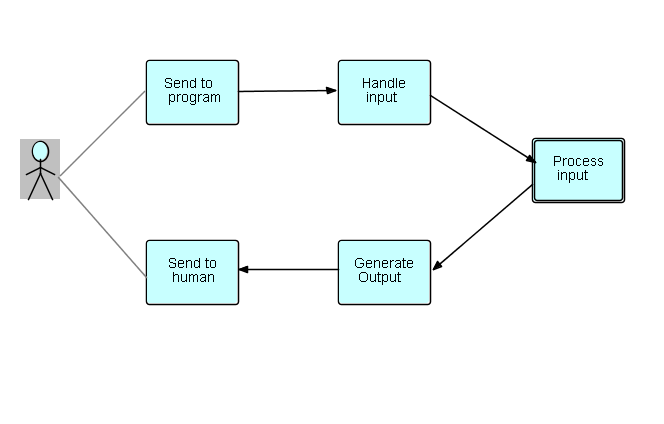
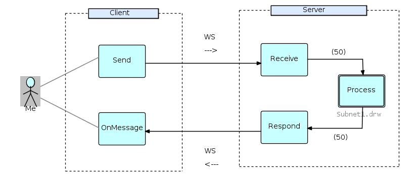
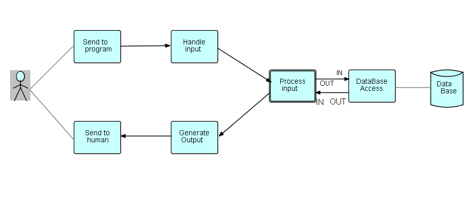

<link rel="stylesheet" type="text/css" href="../style.css">

## Step14 - Interactive Applications

### Overall design

Another interesting application of bracket IPs is in interactive applications.  In this case, typically the application end user sends something to the system, and then waits for a result.  We thus have a very high level diagram that looks like this:

You will notice that we have split the user interaction into two processes: "Send to program" and "send to human" - this allows IPs being sent to the program from different users to be interspersed... and similarly for data returning to humans.  If these two processes had been combined into a single process, it would have had to wait while a human handled the previous response from the machine... and human think time is *much* slower than machine think time!   With separated processes, you will now have data connected with  different users chasing each other round the network.  Of course substreams have to be kept intact, which is why the [LoadBalancer](https://github.com/jpaulm/javafbp/blob/master/src/main/java/com/jpaulmorrison/fbp/core/components/routing/LoadBalance.java) component now sends all IPs in a substream to the same output port...

This approach seems a good match with substreams.  It makes sense to have the first IP in each substream contain information about the context or source of the transaction, e.g. user ID, date and time, maybe language, etc.,  followed by zero or more IPs containing relevant data being sent to or from the application.  Substreams are a good way to represent lists, for example when you want to display all the college courses a student has taken...

There is a practical example of this architecture in the [Web Sockets](https://github.com/jpaulm/javafbp-websockets) repository.  Here we split the above diagram between client and server.  The client code is written in HTML and JavaScript and simply sends a request substream across the sockets connection, and then displays the resulting list substream.  `Receive` and `Respond` are simple "off the shelf" FBP components, and the subnet can be any combination of components and subnets which produce a result substream which will be processed by `Respond`.  As stated above, you can do anything - as long as substreams are not broken up!  I have copied the schematic from [Web Sockets](https://github.com/jpaulm/javafbp-websockets):

"WS" of course stands for Web Sockets.

I realize this may seem rather simple, but a real-life example will of course be more complex... and there are a number of ways performance can be improved, as e.g. by multiplexing (using the [LoadBalancer](https://github.com/jpaulm/javafbp/blob/master/src/main/java/com/jpaulmorrison/fbp/core/components/routing/LoadBalance.java), as shown in the diagram at the end of [JavaFBP-WebSockets](https://github.com/jpaulm/javafbp-websockets/blob/master/README.md)), use of caches, etc.

### Database access

Now let's consider what is going on at the "back end" of this diagram...

So far I have just drawn a single subnet processing input, but of course most applications will need to access data... By the rule of separation of concerns, we naturally use a separate I/O component, which we will call "Database Access", so we will add that into the diagram (using the simpler diagram above), as follows:

.

You will notice that Database Access has an input port *and* an output port, so it is equivalent (in this diagram) to a subroutine call...  Quoting Prof. Gelernter (Linda),

<blockquote>
In our experience, processes in a parallel program usually don’t care what happens to their data, and when they don’t, it is more efficient and conceptually more apt to use an asynchronous operation like Linda’s “out” than a synchronous procedure call.... It’s trivial, in Linda, [or FBP - my comment] to implement a synchronous remote-procedure-call-like operation in terms of “out” and “in” [FBP “send” and “receive”]. There is no reason we know of, however, to base an entire parallel language on this one easily programmed but not crucially important special case.  
</blockquote>
  
You may be wondering why we don't use a subroutine call, but we don't want to wire the name of the Database Access function into the caller's code.  Not even Object-Oriented does that!  But, more importantly, Database Access can operate both in "call" mode, and in "flow-through" mode.  See Gelernter above: "...processes in a parallel program usually don’t care what happens to their data."

In the diagram, I have shown "Process" as a single block - I am assuming that the process needs to retain some state data across the database access.  Another not uncommon scenario is where the database processing is offline, and might take a while - in which case one might split the "Process" block and provide some kind of index to keep track of in-process data requests, and relate the output of Database Access to its input.

 &lt;== <a href="../Step13/">  Previous</a> / <a href="https://github.com/jpaulm/fbp-tutorial-filter-file/"> Index</a> /  Next ==&gt; (none)
