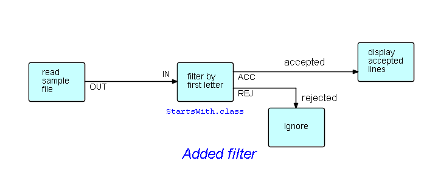

## Step2. Add a filter function 

In this step we are going to add a filter function between the two blocks shown above.  Filter functions (filters, for short) are commonly used in FBP, and conventionally have two outputs: *accepted* IPs, and *rejected* IPs.  Filters should not just drop rejected items, although they can be written this way - it is better for them to route rejected items to another process... which could very well just be a Discard process, if so desired.  In this case, we will do exactly that, as shown here.

The captions `accepted` and `rejected` are generated using a block type in DrawFBP called "Legend".

When you are ready to add the filter function, you will of course need to delete the existing arrow - right click on the arrow itself, and select Delete.

Index: [Go to higher level.](../README.md)
