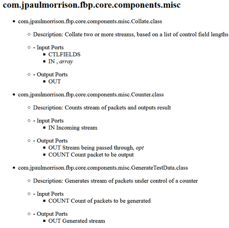
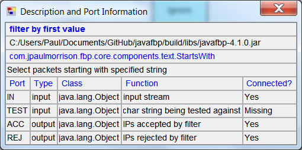

## Step3. Assigning a component to the filter block

For the filter function, we need a component that will match the first character against a character provided as a parameter. As it happens(!), JavaFBP provides a precoded, reusable FBP component called `StartsWith`, which takes a character string as its parameter (specified using an IIP), and whose output port names are ACC and REJ.  **FBP is not designed to be a coding language**.  The ideal is to work with a library of precoded, pretested components.  **You only need to write a component if you can't find an appropriate one - and in that case, you should try to write one that other people will find useful.**

How do we find a suitable component?  Well, the first step is to install JavaFBP ( https://github.com/jpaulm/javafbp ) in a directory called `javafbp`.  Components are grouped by function, so you can either go there directly, or you can display the JavaFBP components list by clicking on https://htmlpreview.github.io/?https://github.com/jpaulm/javafbp/blob/master/compList.html then `Edit/Find in This Page` (unfortunately you cannot click on the `compList.html` file directly on GitHub).  The Javadoc facility does not provide the information you will need, so we will not be maintaining it in future releases.

**TODO: javadoc doesn't show port names and their functions! See issue #1. Closed**

Here is a portion of `compList`:

We now have to associate the `StartsWith` component with the filter block.  Since the component is in JavaFBP, you will need to use DrawFBP's `Locate JavaFBP Jar File` function, and then find `StartsWith` in that jar file, using the `Choose Component/Subnet Class` block function provided by DrawFBP. 

Since different components specify different port names, you need to find out the port names used by `StartsWith`.  There are three ways available to do this:

- go to the source code for the component in the JavaFBP repo ( `src/main/java/com/jpaulmorrison/fbp/core` ), and look at the annotations (`@OutPorts` and `@InPorts`), or 

- once you have associated a component with your block in the diagram, you can right click on the `Display Description and Port Info` function provided for DrawFBP blocks, which will bring up a display like the following (doing the associate function will also bring this up):

Of course, if you haven't filled in any of the port names, this display will show `NO` in the `Connected?` column.

- look at `compList.html` by clicking on http://htmlpreview.github.io/?https://github.com/jpaulm/javafbp/blob/master/compList.html , then `Edit/Find in This Page` .

**TODO: Port display for many components are missing port function annotations - these need to be filled in in JavaFBP.  See issue #2**

After filling in the `IN`, `ACC` and `REJ` port names, the diagram should now look like this:

If any port names have been misspelled, you will see a port name `Missing`, and another one unrecognized (`?` under `Connected?`).