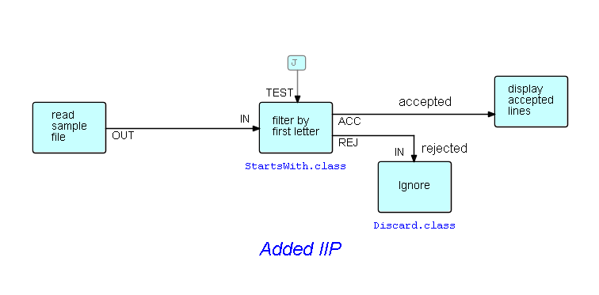

## Step4.  Specifying an IIP

Now, as shown in the port list shown above, `TEST` is the port name for the IIP which specifies the test character for matching. As stated above, IIPs are the way FBP reusable components are parameterized.  Usually the parameter is specified in a network definition, so that a network can use the same component in more than one place in the network - with different parameters - but IIPs have the added advantage that the network can easily be changed to present the parameter information as a normal IP, obtained from an upstream process.

In this case the parameter for `StartsWith` will be provided as an IIP, specified in the diagram.  In DrawFBP just click on the button at the bottom marked `Initial IP`, after which clicking on the drawing screen will now create an IIP, and allow some text to be entered.  The diagram now looks like this:

Selecting `StartWith` and clicking on `Display Description and Port Info` will verify that all ports are now correctly connected.