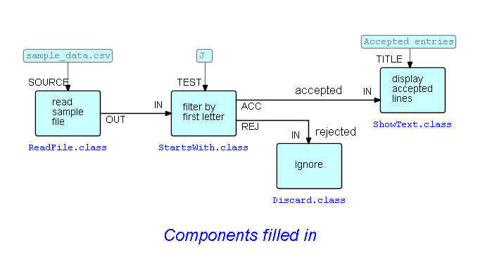

## Step5.  Associating components with the other blocks

Pretty straightforward: just click on each block, and select `Choose Component/Subnet Class`.  

The first block (`read sample file`) would most probably use the `ReadFile` component in the `core/components/io` package in the JavaFBP jar file.  This requires an IIP containing the file name - port name `SOURCE`.

The `ignore` block would most likely use the `Discard` component in the `core/components/routing` package, although of course you could use any component here, or even route the "ignored" IPs to other parts of the diagram.

That just leaves `display accepted lines`.  In his example, Bob Corrick decided to use the `ShowText` component.  This component puts up its output in a separate window, and requires an IIP with port name `TITLE`.  `ShowText` has an optional port called `OUT` - if this is connected, incoming IPs are routed to this port after being displayed.

Here is the final diagram:

Next:  [Step6. Generating a running program.](../Step6/README.md)

Index: [Go to higher level.](../README.md)
