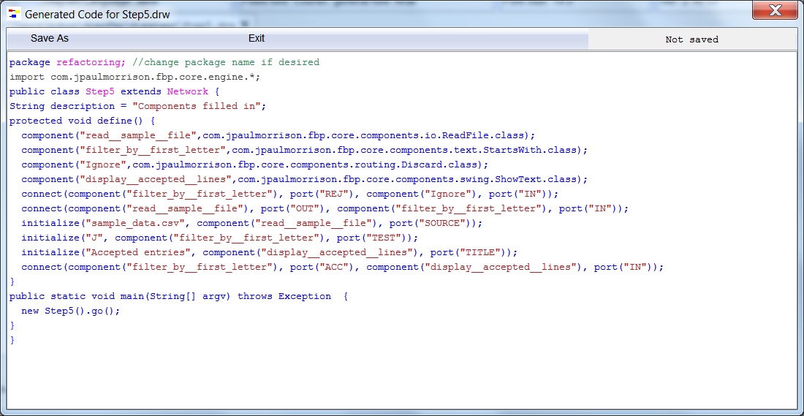

<link href="../style.css" rel="stylesheet" type="text/css">

## Step6.  Generating a running program

Now we have all the necessary information filled in to generate a running program, so click on `Generate Java Network` - Java is the default language, so this function has `Java` filled in in the File menu. This can be changed by clicking on `Select Diagram Language`: currently 4 languages are supported - Java, C#, JSON and FBP.

Here is the result:

DrawFBP remembers the last used package name, so it allows the developer to change it to whatever matches the directory structure - or Eclipse will prompt him/her to change it, if necessary, when the code is executed. 

DrawFBP's colouring of code is mostly to make character strings and comments stand out from the rest of the text.

`component` and `connect` are self-explanatory! `initialize` builds an IIP, and connects it to an input port of a component.

  
 <a href="../Step5/README.md"> &lt;== Previous</a> / <a href="../README.md"> Index</a> / <a href="../Step7/README.md"> Next ==&gt; </a>
 
